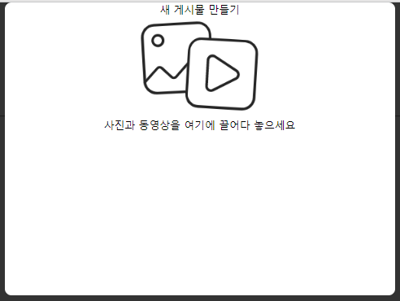

## 이미지 업로드
- File Structure Version
- Modal Version

### Structure
```
├── static/css
│   └── image_upload.css
│
├── imgs
├── templates 
│   ├── index.html         // 메인 페이지
│   └── modal_upload.html  // 모달 Ver html
│
└── app.py // 진입점
``` 

### API Endpoint
- @app.route('/fileupload', methods=['POST'])

### 기능 스크린샷
<table>
<th><td></td><td>File Ver</td><td>Modal ver</td></th>
<tr><td></td><td></td><td></td></tr>
</table>


